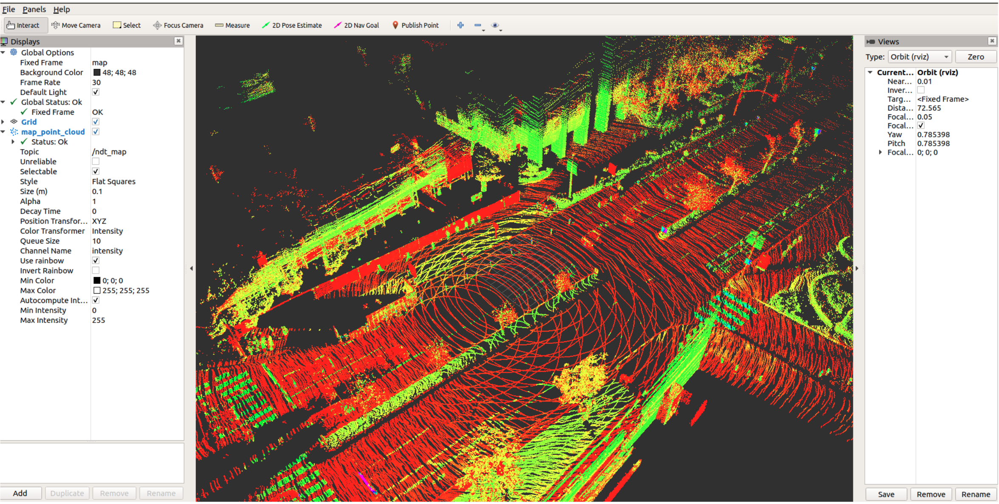
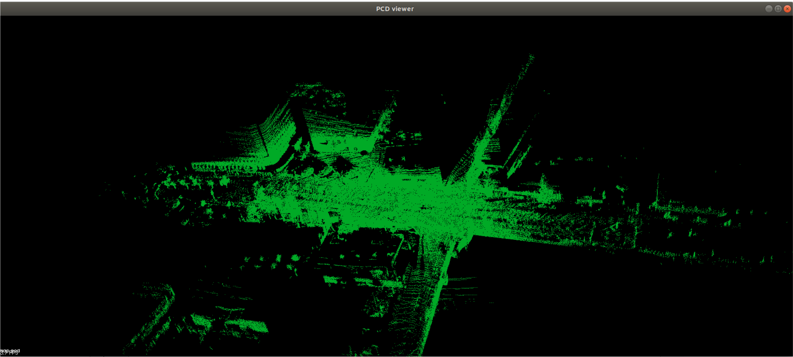
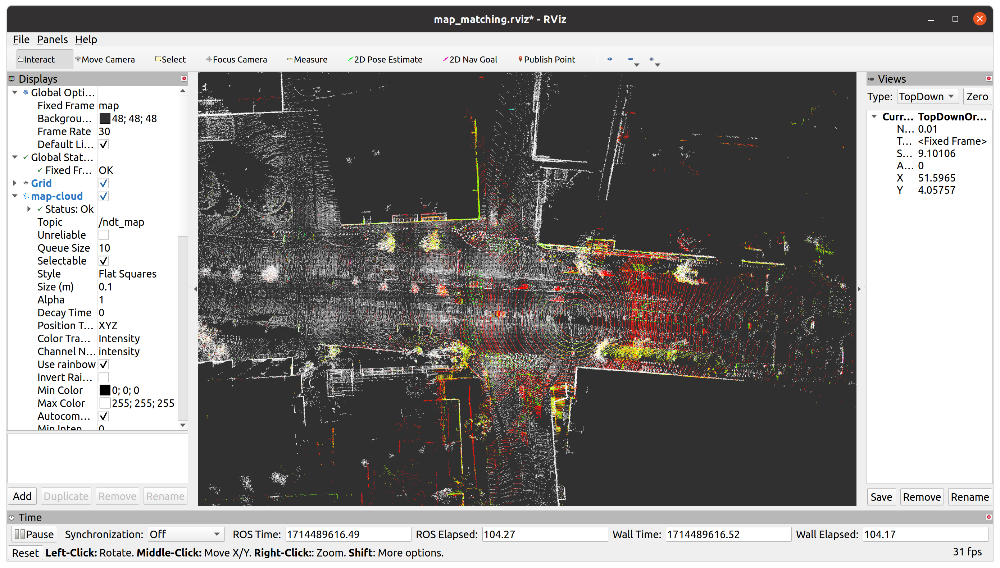

# aeng_563_localization_mapping

[](LICENSE)

[](https://wiki.ros.org/noetic)

This the example code for project 1: mapping and localization.

## How to use

### Step 1

**Pre-requisite**

```bash
sudo apt install ros-noetic-jsk-rviz-plugins
sudo apt install -y libpcap-dev 
sudo apt-get install pcl-tools
```

### Step 2

**Download the code. Open a terminal and use the command below:**

```
cd ~
mkdir -p catkin_ws/src
cd catkin_ws/src
git clone https://github.com/ros-drivers/velodyne.git
git clone https://github.com/xiaxin2000/aeng_563_localization.git
cd ~/catkin_ws
catkin_make
```

### Step 3

**Download the data from Google Drive:**

- ROSBag sample: [rosbag link](https://drive.google.com/file/d/1LYQiMRAl_39MFMlcwxHxtLVEe-fCAoZK/view?usp=sharing)

- Point cloud map sample: [map.pcd](https://drive.google.com/file/d/1YDWAhN4uz1tXbDw4xwanHIIWhBYTaNpI/view?usp=sharing)

Then, save the ROSBag and point cloud map into `~/catkin_ws`

## Demo 1: Mapping

 **Mapping based on LIDAR using Normal Distribution Transformation algorithm**

### Step 1

Change the line 3 of the file in `~/catkin_ws/src/aeng_563/lidar_localizer/launch/ndt_mapping.launch` to your own workspace. 

### Step 2

Open a terminal and use the command below:

```
cd ~/catkin_ws
source devel/setup.bash
roslaunch lidar_localizer ndt_mapping.launch
```

You will see: 



### Step 3

Open another terminal:

```bash
cd ~/catkin_ws
rosbag play -r 0.2 2023-03-08-18-32-45.bag
```

### Step 4

Open a third terminal after a few seconds:

```bash
rostopic pub -r 1 /savemap std_msgs/Bool "data: true"
```

The map will be save in your specified path. 

Try to tune other parameters in the launch file and see what will happen. 

### Step 5

After you see the map in the corresponding folder, you can check the map in a terminal using the command below:

```bash
pcl_viewer map.pcd
```

You will see: 



## Demo 2: Localization 

**Localization based on LIDAR using Normal Distribution Transformation algorithm and existing generated map**

### Step 1

Change the line 10 of the file in `~/catkin_ws/src/aeng_563/lidar_localizer/launch/ndt_matching.launch` to your own workspace. 

### Step 2

Open a terminal and use the command below:

```
cd ~/ catkin_ws
source devel/setup.bash
roslaunch lidar_localizer ndt_matching.launch
```

### Step 3

Open another terminal:

```
cd ~/catkin_ws
rosbag play -r 0.2 2023-03-08-18-32-45.bag
```

You will see the following results:



